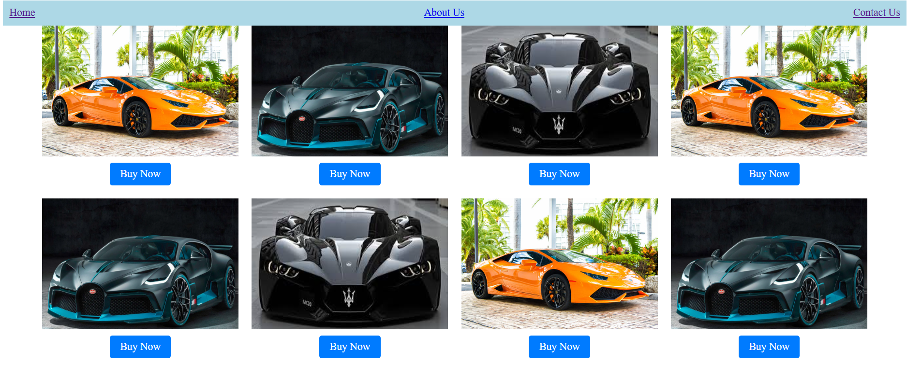

# Car-Website
This is an e-commerce automobile website used to close car deals.

# ⚙️ Technologies
- **HTML**
- **CSS**
- **BOOTSTRAP**

# 👇 Steps to run
**On Visual Studio app**
- Open Visual Studio Code
- Click File → Open Folder
- Select the folder that contains my website files
- Open the index.html file
- Right-click on index.html
- Open with Live Server
To use this method you need the extension:👉 Live Server
Install it from the Extensions tab if you don't have it.

**Run Without Extension**
- Go to your project folder
- Double-click index.html
It will open directly in your browser (Chrome, Edge, etc.).

# 📷 Screenshots 

